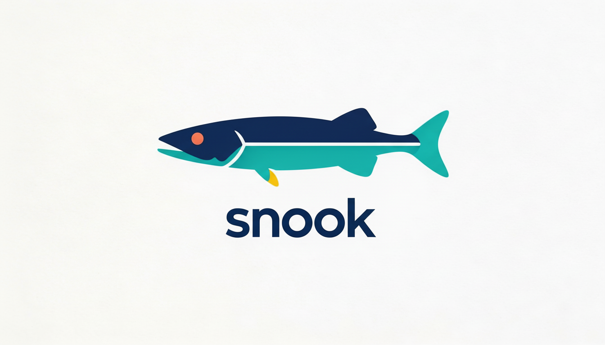

<p align="center">
  
</p>

A Java framework for building and deploying HTTP servers on [Eclipse Jetty](https://eclipse.dev/jetty/).
Snook handles the boilerplate of server configuration, TLS, authentication,
session management, metrics, and static asset serving so you can focus on your application.

## Features

- **Server Builder** &mdash; Fluent builder pattern for configuring and launching Jetty servers from `.properties` files or programmatically
- **Authentication** &mdash; 15+ authenticators including Basic, Bearer token, HMAC-signed cookies, BCrypt, TOTP (2FA), and composable multi-auth strategies
- **Session Management** &mdash; Cookie-based sessions with automatic expiration, metrics, and pluggable storage
- **TLS/SSL** &mdash; Full HTTPS support with automatic keystore reloading
- **Metrics & Health** &mdash; Built-in [Dropwizard Metrics](https://metrics.dropwizard.io/) integration with health checks and uptime reporting
- **Static Assets** &mdash; Configurable static file serving with cache control, gzip, and ETags
- **Request Logging** &mdash; NCSA format logging to file, console, or SLF4J
- **Error Handling** &mdash; Content-type aware error responses (JSON, HTML, text) with error tracking IDs
- **QR Code Generation** &mdash; Utility for generating QR codes for 2FA provisioning
- **Log4j2 Configuration** &mdash; Programmatic Log4j2 setup from `.properties` files

## Requirements

- Java 17+
- Maven 3

## Build

```bash
mvn clean package
```

## Documentation

* [Javadoc](https://attribyte.github.io/snook/)

## License

Copyright 2018 [Attribyte Labs, LLC](https://attribyte.com)

Licensed under the Apache License, Version 2.0 (the "License");
you may not use this file except in compliance with the License.
You may obtain a copy of the License at

[http://www.apache.org/licenses/LICENSE-2.0](http://www.apache.org/licenses/LICENSE-2.0)

Unless required by applicable law or agreed to in writing, software distributed under the License
is distributed on an "AS IS" BASIS, WITHOUT WARRANTIES OR CONDITIONS OF ANY KIND, either express or implied.
See the License for the specific language governing permissions and limitations under the License.
